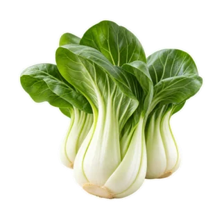
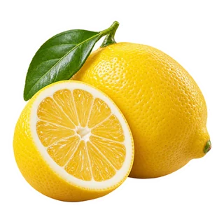
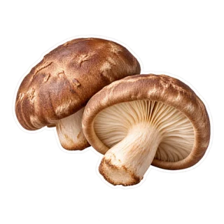
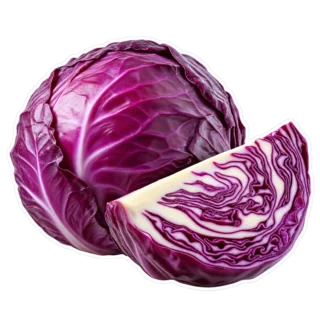

# Soft Studio Ingredients

**520 transparent ingredient illustrations for recipe apps, menus, and meal planners.**

[Browse the collection](https://soft-studio-ingredients.vercel.app) · [Download v1.0.0](https://github.com/alextyhwang/soft-studio-ingredients/releases/tag/v1.0.0) · [CC BY 4.0](LICENSE)

| | | | |
| --- | --- | --- | --- |
|  |  |  |  |

The collection includes 20 culinary groups, a consistent Soft Studio style, transparent backgrounds, and stable ingredient IDs. The website supports name search, category filters, light/dark/checkerboard backgrounds, and individual image downloads.

## Downloads

- [WebP pack](https://github.com/alextyhwang/soft-studio-ingredients/releases/download/v1.0.0/soft-studio-ingredients-webp-v1.0.0.zip): all 520 optimized images, up to 320 pixels. Image files total 9.78 MB.
- [Original PNG pack](https://github.com/alextyhwang/soft-studio-ingredients/releases/download/v1.0.0/soft-studio-ingredients-png-v1.0.0.zip): all 520 originals at their generated resolution. Image files total 776.73 MB.
- [CSV metadata](metadata/ingredients.csv) and [JSON metadata](metadata/ingredients.json): names, groups, dimensions, file sizes, and SHA-256 hashes.
- [Release checksums](https://github.com/alextyhwang/soft-studio-ingredients/releases/download/v1.0.0/SHA256SUMS.txt): verify the downloaded archives.

Both image packs include metadata, the dataset card, and licensing/attribution documents. The repository contains the optimized images; original PNGs are release downloads to keep clones small.

## Use an image

Copy an image from `images/` into your project:

```html

```

Load `metadata/ingredients.json` to get the stable IDs and per-file information:

```js
const { items } = await fetch('/metadata/ingredients.json').then(r => r.json());
const lemon = items.find(item => item.id === 'lemon');
console.log(lemon.webp.path); // images/lemon.webp
```

## License

The dataset is licensed under **CC BY 4.0**. Reuse and adaptations, including commercial use, are allowed with credit, a license link, and a notice of changes. Suggested credit:

> Soft Studio Ingredients by Alex Wang, licensed under CC BY 4.0.

Link the project and license when using this line. See [ATTRIBUTION.md](ATTRIBUTION.md) for the full example and [LICENSE](LICENSE) for the terms.

## Provenance

The images were AI-generated with Codex image generation, then checked with automated file validation and assistant visual review. Original PNGs and optimized WebPs can have different rims because some display assets received white-edge treatment. They are illustration assets, not photographs or food-identification ground truth. See the [dataset card](DATASET_CARD.md) and [recorded prompts](metadata/prompts.json).

## Run the website

Node.js 20 or newer is sufficient; no dependencies are required.

```sh
npm run verify
npm run check
npm run build
python -m http.server 8093 --directory dist
```

Open `http://localhost:8093`. `dist/` is a standalone static site suitable for Vercel. Build checks fail if the catalog does not contain 520 unique ingredient IDs or if an image no longer matches its recorded hash.

To make release ZIPs from locally available originals, run `python scripts/package-release.py`. The script expects the PNGs in `.release/originals/`; obtain those from the original PNG release archive when working from a clone. It verifies every PNG and WebP hash before packaging.
